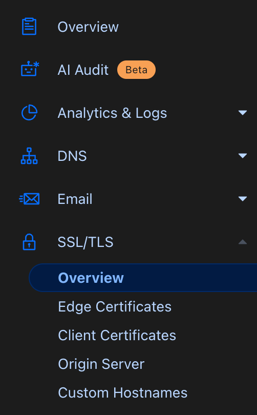
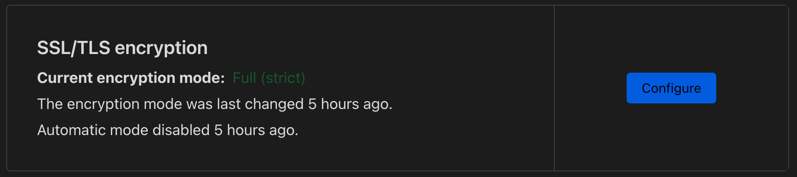

# {{ $frontmatter.title }}

If you've switched DNS to CloudFlare and you're noticing that your site fails to load when you enable the proxy and
reports something like "Too many redirects" then you should just need a small configuration change. You probably have to
switch your SSL/TLS option from "Automatic SSL/TLS (default)" to "Custom SSL/TLS" and then switch from "Flexible" to
"Full (strict)".

If you don't have a "real" certificate for your backend server you may need to choose "Full" instead of "Full (strict)".

# Step 1: Go to SSL/TLS overview for your domain

# Step 2: Click configure

# Step 3: Select Full (strict)

 option")