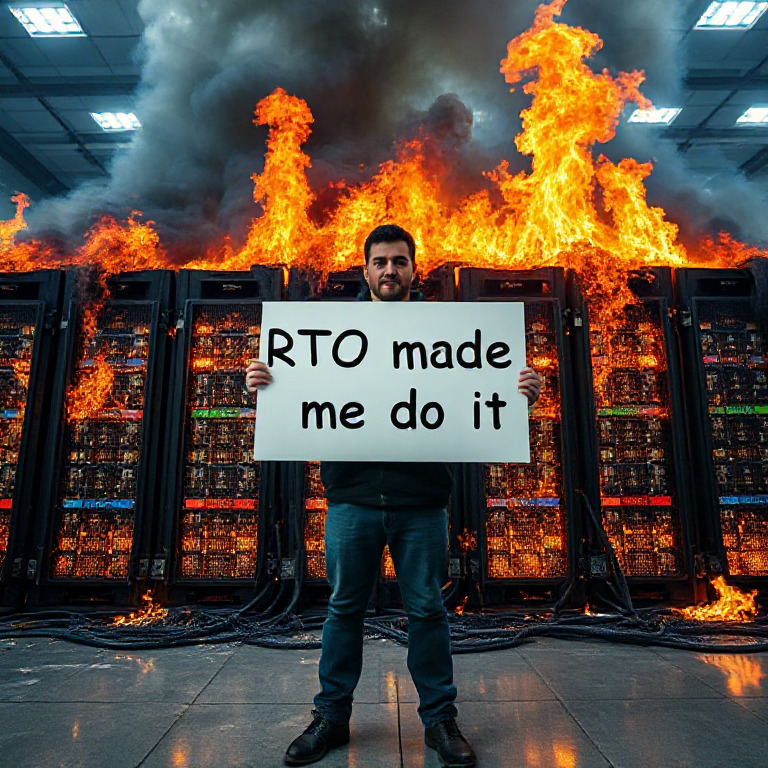
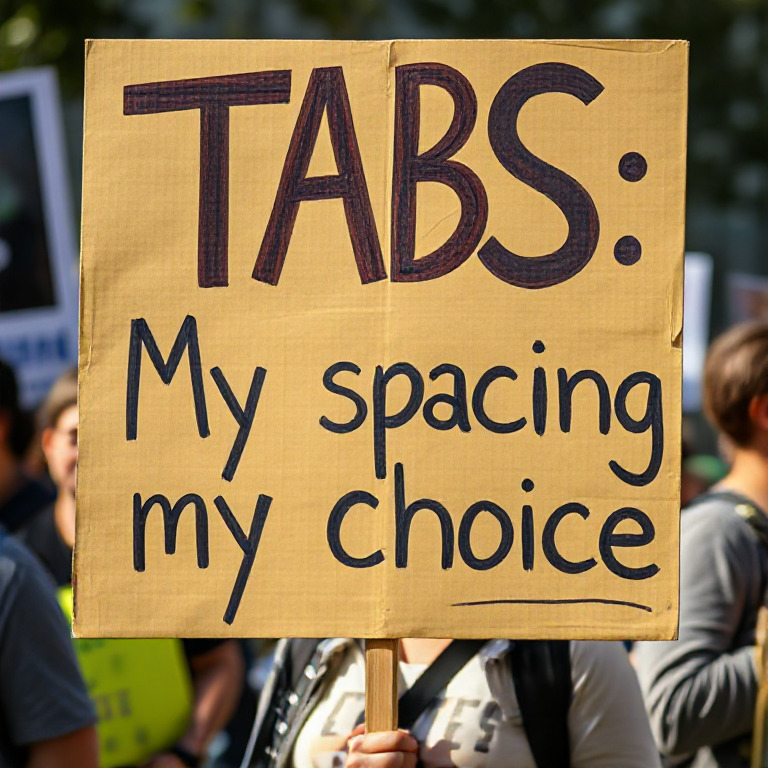
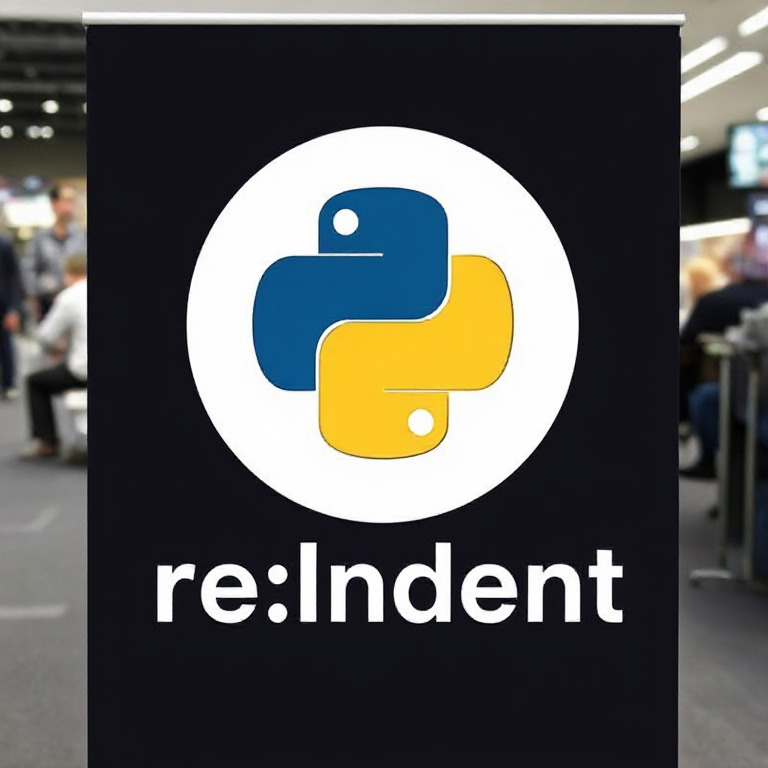

# {{ $frontmatter.title }}

This is the first in a series of posts that will explore the results of running various AI models on my shower thoughts.

# FLUX-1.schnell - The absurdity of language wars

Many people have seen the Laravel/PHP Lambo pictures. It's just more proof that the output is more important than the
library/language choice.

# FLUX-1.schnell - Dissatisfaction with RTO

Some people are REALLY unhappy with RTO policies

# FLUX-1.schnell - Arguing over whitespace

I like tabs because I can choose how wide they are without reformatting your code.

Pasting Python code is always painful. I propose we have a yearly conference to discuss how to improve it.

